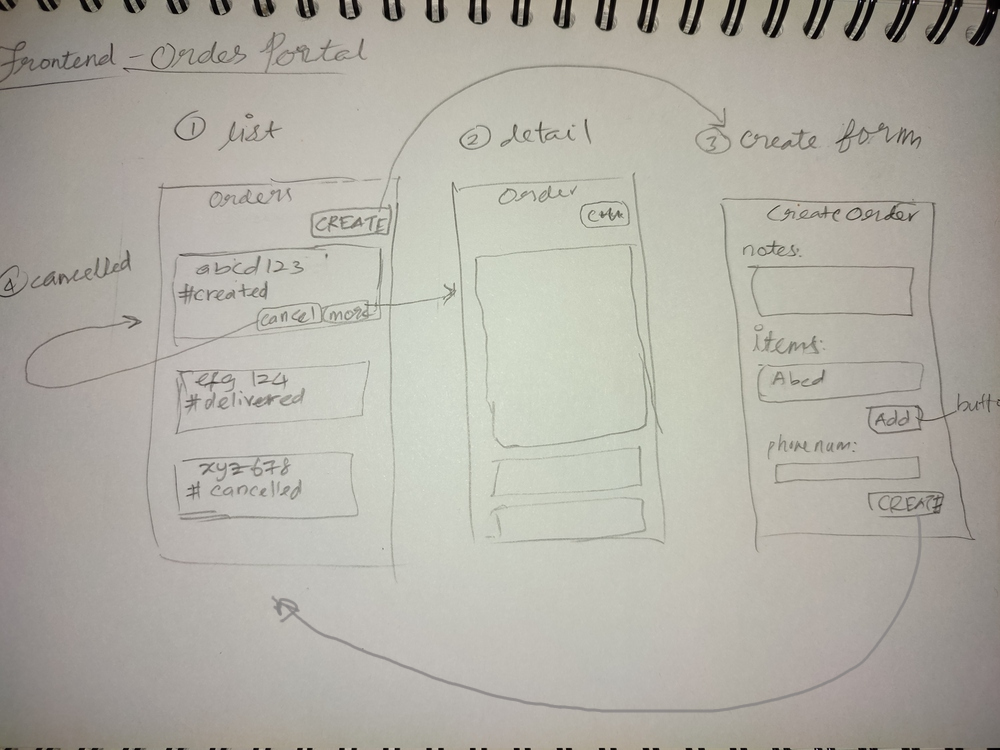

# Building the system

1. Understand the requirements.

## 1. Understand the requirements

[See note of the requirements](task-requirement.md)

## 2. How I am going to do this

4 keys when build something:

1. Functional - make the system working as expected

2. Timeline - how long its gonna take. Build fast or build correctly. I did not receive hard deadline here, but I do not want to spent a lot. So, the result should be good enough.
   
3. Code quality - focus on functional with good enough quality. Then refactor later. Should have:
   - Separate dir for development & production `src` & `dist`
   - Use linter
   - Tests (at least unit test)

4. UI quality - UI quality is not the requirement. So, will use familiar Chakra UI because I am familiar with it.
   
Make things work with familiar tech stack & only 1-2 new tech. Then refactor with technology specified by requirements.

- [x] Start with wireframe of the frontend to understand more about the system. [2.1](#understand-more)
- [ ] Decide on data structure
- [ ] Build frontend
  - [ ] Tech stack decision
  - [ ] Setup. Build tools, linter, 
- [ ] Build Order App micro-service
  - [ ] Tech stack decision
- [ ] Build Payment App micro-service
  - [ ] Tech stack decision

### 2.1 Understand more about the system [2.1](#understand-more)

Architecture draft

Wireframe order portal

