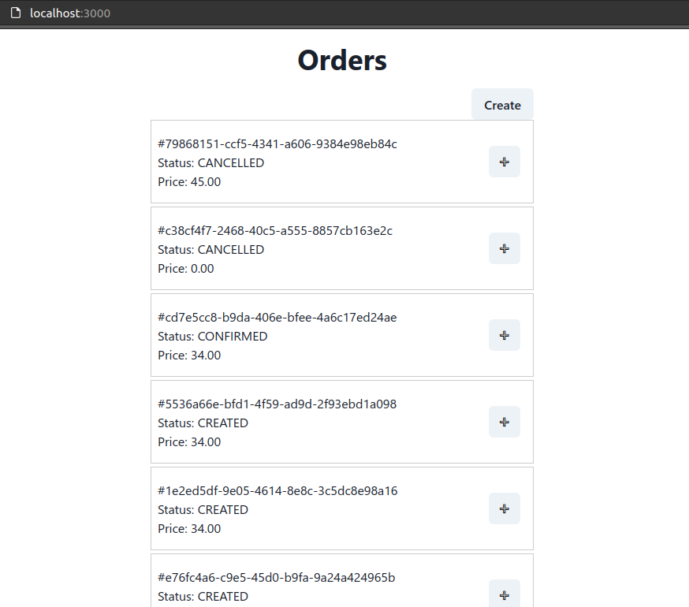

## How to run

### Run locally

1. Run Order portal (frontend)
2. Run Order App micro-service
3. Run Payment App micro-service

### Run with docker

Here, I am using `docker-compose` to deploy all the system in one command.
I never use kubernetes, so I cannot give guide how to deploy into kubernetes.
See `docker-compose.yml` for docker setting & change setting to your environments / system.

#### How to deploy the system using docker & docker-compose in local to test

> **Requirements**: `docker` & `docker-compose` is installed.

1. Get the code from [github](https://github.com/fakhrullah/another-iv-assessment).
   
   ```
   git clone https://github.com/fakhrullah/another-iv-assessment.git
   ```

2. Move to assessment directory.
   ```
   cd another-iv-assessment/
   ```

3. Run all the system using without change any setup.
   ```
   docker-compose -d --file ./docker-compose.yml up
   ```

4. Give some times, to allow docker-compose build & run all.

5. Then, go to `http://localhost:3000` in your browser. It should look like image below:
   
   

6. You can test the app.

### Key points to run on your own environments with own settings

There are 3 system here:
    - Order App - `./order-app/` - microservices to handle Order
    - Payment App - `./payment-app/` - microservices to handle Payment
    - Order Portal - `./order-portal/` - Web app to manage Order

#### About Order App

Order App required 3 environments to be set. 

    - `NODE_ENV` = Set it `development` to prevent cors error
    - `POSTGRESQL_CONNECTION_STRING` 
      - Order App **MUST** be connect to Postgres Database
      - Migrations is **required** to create required tables
      - Seeder for `01_seed_order_status.js` also **required** to intialize order status
      - By default, in `docker-compose.yml`, I connect to 3rd-party database (elephantsql.com) & I already add some data inside it.
    - `PAYMENT_APP_URL` - URL to Payment App `payment-app` we created 
  
#### About Payment App

Payment App required 2 enviroments to be set.

    - `NODE_ENV` - Use `development` to prevent cors error
    - `ORDER_APP_URL` - URL to the Order App (`order-app`)

#### About Order Portal

I create 2 Dockerfile for Order Portal. `Dockerfile` for production optimized & `Dockerfile.dev` for running the development version.

Order Portal is React app (CRA), the way is used environment not like others 2 backends. CRA will read the environment on `npm run build` & `npm start`.
So, the enviroments is production is read when build the code (`inside Dockerfile`).

Because of that, we need to confirmed `order-app` static URL before build. It is easier if we can point static domain to it (eg: order.domain.com).

So, that is why I use `development` version inside my `docker-compose.yml`.

I don`t know if there are tools or different to handle this.

Order Portal required 3 environment to be set.

    - NODE_ENV = will be use to find `.env` to build the app
    - `REACT_APP_ORDER_APP_URL` - URL to the Order App (`order-app`)
    - `REACT_APP_USER_ID`
      - This is user_id paramater used to filter data from order-app.
      - In production it should be cookie of auth-token
      - I use it like this, because Order App required it on every `/orders` url requested.
  
## Thank you

That is all from me. Hopefully the note above is enough to deploy on other environments.

[See more on notes dir](notes/toc.md)
